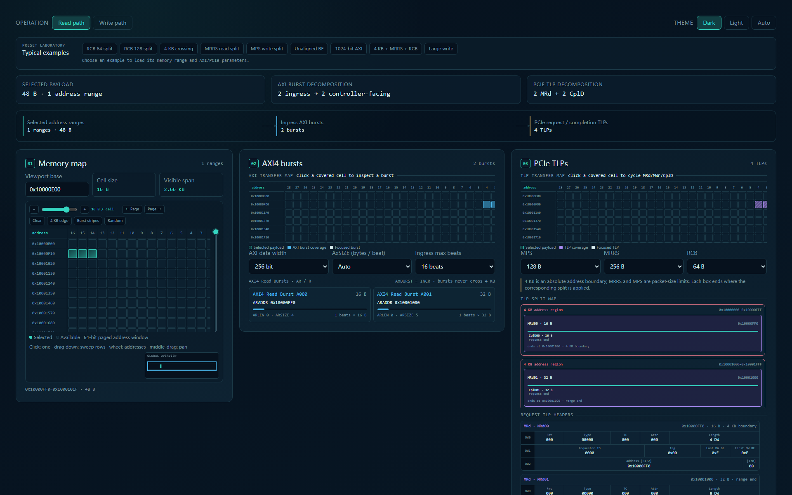

# Bus Protocol Lab

Standalone visual tools for bus protocol learning, design review, and debug. No
build step or local server is required: download an HTML file and open it
directly in a browser.

## AXI to PCIe Packet Studio

[Open the latest AXI to PCIe Packet Studio](axi-pcie-packet-studio.html)

The Packet Studio is an interactive, single-page view of how selected memory
bytes become AXI4 transactions and then PCIe TLPs. It keeps the source memory,
AXI transfer map, and TLP transfer map linked so a selected transaction can be
followed through every split.

Highlights:

- 64-bit virtual memory map with semantic zoom from coarse regions down to
  byte-level cells.
- Click, drag, row sweep, pattern generation, overview navigation, and
  fine-grained selection inside mixed cells.
- Configurable AXI bus width up to 1024 bits, `AxSIZE`, and maximum burst
  length.
- PCIe request splitting at 4 KB, MPS, and MRRS limits.
- Read-path visualization from Memory Read Request (`MRd`) to Completion with
  Data (`CplD`), including selectable 64 B or 128 B RCB behavior.
- Header views for `Fmt/Type`, Length, Address, First DW BE, Last DW BE,
  Byte Count, and Lower Address.
- Synchronized AXI/TLP memory maps with identical cell size, column count,
  address labels, and scrolling.
- Built-in examples for RCB splits, 4 KB crossings, MRRS/MPS limits, unaligned
  byte enables, 1024-bit AXI, and large writes.

### Quick start

1. Download [`axi-pcie-packet-studio.html`](axi-pcie-packet-studio.html).
2. Double-click the file to open it in a modern browser.
3. Choose a built-in example or select a memory range manually.
4. Click an AXI burst or TLP region to correlate the same payload across maps.

## Other demos

- [AXI Atomic Demo](axi4-atomic-format-table.html) — interactive AXI4 atomic
  byte-lane view for memory selection, DNOC request-data placement, and
  IP-facing AXI `WSTRB`/`WDATA` placement.
- [PCIe TLP Split Demo](pcie-tlp-split-demo.html) — focused Memory Read
  Request and Completion split visualization for MRRS, MPS, RCB, and 4 KB
  boundaries.
